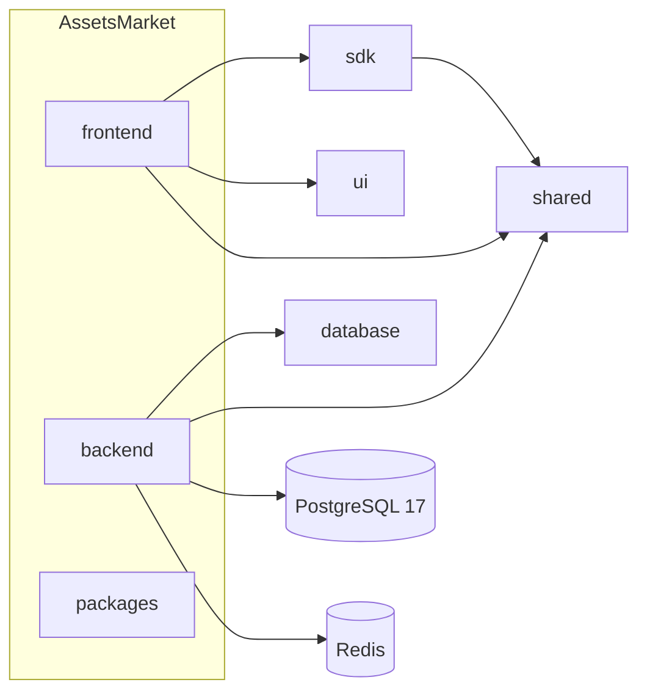

# AssetsMarket — System Architecture

## Overview

AssetsMarket is a **pnpm + Turborepo monorepo** with physically separated `frontend/` and `backend/` applications and shared `packages/`.

## Modular monolith (backend)

Single deployable Express app. Each domain module owns:

- **controllers** — HTTP boundary
- **services** — business orchestration
- **repositories** — Prisma data access
- **dto** — request/response shapes
- **validators** — Zod input schemas

Cross-cutting: `middleware/`, `integrations/`, `events/`, `jobs/`, `config/`, `logging/`.

## Feature-based frontend

Next.js App Router for routing; **features/** for vertical UI logic. Server state via **TanStack Query**; ephemeral UI state via **Zustand** in `state/`. API access only through `@assetsmarket/sdk`.

## Packages

| Package | Role |
|---------|------|
| `ui` | Design system (shadcn, dark glass) |
| `shared` | Constants, shared types, Zod validators |
| `sdk` | Typed HTTP client for frontend (and scripts) |
| `database` | Prisma schema + client (backend only) |

## Infrastructure path

Local: Docker Compose (Postgres 17, Redis). Production: AWS (ECS, RDS, ElastiCache, S3) + Cloudflare (CDN, WAF, DNS).

## Explicit non-goals (scaffold)

No routes, Prisma models, services implementation, or UI components in this phase.

See [REPOSITORY_STRUCTURE.md](./REPOSITORY_STRUCTURE.md) for the full tree.
