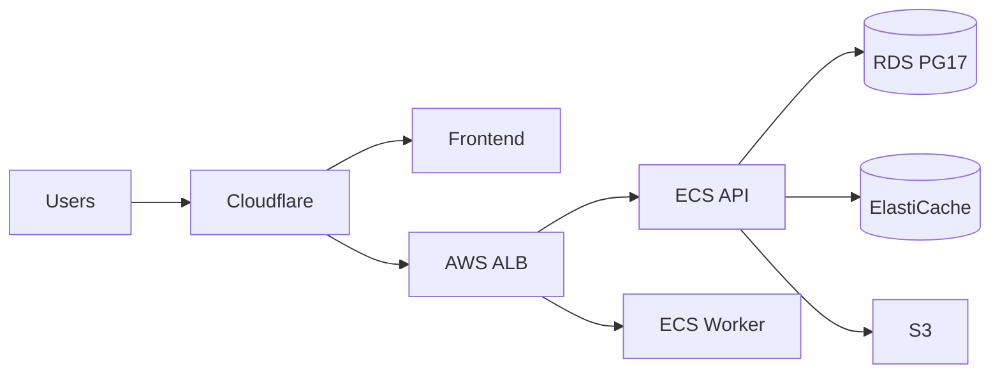

# Infrastructure

```
infrastructure/
├── docker/         # Local Postgres 17, Redis, Mailhog
├── redis/          # Production tuning notes
├── aws/            # Terraform environments + modules
├── cloudflare/     # CDN, DNS, WAF (future)
├── monitoring/     # CloudWatch, alarms, dashboards
└── scripts/        # Deploy, migrate, seed helpers
```

## Production target



Local dev uses Docker only — see [docker/README.md](docker/README.md).
