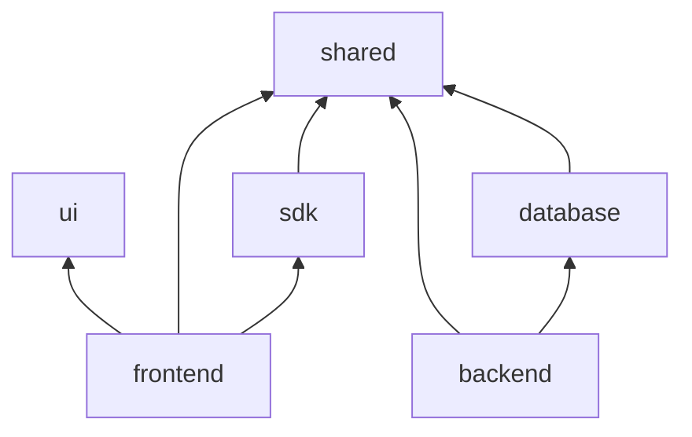

# Packages

Shared libraries — imported by `frontend/` and/or `backend/`, never the reverse.

## Package responsibilities

### [@assetsmarket/ui](ui/README.md)

Design system: shadcn/ui primitives, glass variants, Tailwind preset.

- **Used by:** frontend only
- **Must not:** call APIs, import Next.js in components

### [@assetsmarket/shared](shared/README.md)

Contracts: enums, error codes, Zod validators, DTO types used on both sides.

- **Used by:** frontend, backend, sdk, database seeds
- **Must not:** import Express, React, or Prisma

### [@assetsmarket/sdk](sdk/README.md)

Typed HTTP client generated/maintained against API contracts.

- **Used by:** frontend `services/`, E2E helpers, scripts
- **Must not:** import Prisma; only talks to backend over HTTP

### [@assetsmarket/database](database/README.md)

Prisma schema, migrations, generated client, seed scripts.

- **Used by:** backend only (and integration tests)
- **Must not:** be imported by frontend or sdk

## Dependency graph

## Config packages (optional)

`config-eslint`, `config-typescript` — shared tooling configs for consistent lint/TS across apps.
